<div align="center">
   <h1> WiFi Attendance 📡 </h1>

   
   
   
   
   
   
   
   
</div>

## 📌 Overview

**WiFi Attendance** is a full-stack Node.js web application that automates meeting attendance tracking by verifying participants are connected to the **same WiFi network** as the meeting host. It includes QR code fallback for joining, live polling/voting, PDF report generation, and an admin dashboard — all backed by a self-contained file-based database.

## 🎯 Objectives

- Automatically mark attendance by detecting shared WiFi network presence.
  Provide a QR-based fallback for participants unable to join via WiFi.
  Enable hosts to create real-time polls during meetings.
  Generate downloadable PDF reports with attendance logs and poll results.

## 🛠 Features

- **WiFi-Based Attendance:** Detects the host's local network IP and validates participants are on the same subnet.
- **QR Code Fallback:** Inline QR codes for quick mobile joining.
- **Live Polling:** Hosts can create polls; participants vote in real-time with live-updating results.
- **PDF Reports:** Client-side PDF generation (via jsPDF) with attendee tables and poll summaries.
- **Join/Leave Tracking:** Full attendance log with timestamps for each join and leave event.
- **Meeting Management:** Create, join, end, and delete meetings with persistent storage.
- **Authentication:** JWT-based login/signup with bcrypt password hashing.
- **Dark/Light Theme:** Material Design 3 inspired UI with persistent theme toggle.
- **Docker Support:** Ready-to-deploy with Docker and docker-compose.

## 🎨 Color Palette Reference (Material Theme)

| Theme                | Background                                                                                                         | Foreground                                              | Primary / Accents                                                                                                                                                             | Status                                                                                                                                                                        |
| :------------------- | :----------------------------------------------------------------------------------------------------------------- | :------------------------------------------------------ | :---------------------------------------------------------------------------------------------------------------------------------------------------------------------------- | :---------------------------------------------------------------------------------------------------------------------------------------------------------------------------- |
| **Material Darker**  | <br> |  | <br><br> | <br><br> |
| **Material Lighter** | <br> |  | <br><br> | <br><br> |

## 📂 Project Structure

```text
.
├── data/                       # Persistent JSON storage (users, meetings)
├── lib/
│   └── mongoose-mock.js        # File-based MongoDB mock
├── middleware/
│   └── auth.js                 # JWT authentication & admin middleware
├── models/
│   ├── User.js                 # User schema (username, password, role)
│   ├── Meeting.js              # Meeting schema (title, host, IP, active)
│   ├── Attendance.js           # Attendance schema (user, meeting, logs)
│   └── Poll.js                 # Poll schema (question, options, votes)
├── public/                     # Public assets (CSS, JS, images)
├── results/                    # UI screenshots and demo video
├── template/                   # EJS templates
├── views/
│   ├── partials/
│   │   └── header.ejs          # Shared head, nav bar, theme toggle
│   ├── dashboard.ejs           # Main dashboard (create/join/list meetings)
│   ├── meeting_room.ejs        # Meeting room (attendance, polls, QR)
│   ├── login.ejs               # Login page
│   ├── signup.ejs              # Signup page
│   └── qr.ejs                  # Full-page QR display
├── Dockerfile                  # Docker build (node:18-alpine)
├── docker-compose.yml          # Docker Compose configuration
├── package.json                # Project dependencies & metadata
├── server.js                   # Express server + all route logic
└── README.md                   # Documentation
```

## 🚀 Working

1. **Authentication**  
   Users sign up and log in. Passwords are hashed with bcrypt; sessions are managed via JWT tokens stored in httpOnly cookies.

2. **Meeting Creation**  
   Hosts create a meeting room. The app auto-detects the host's network IP using OS network interfaces.

3. **WiFi Verification [`server.js`](server.js)**  
   Participants join by meeting ID. The server compares client IPs — if both are on the same subnet (matching first 3 octets or both private), attendance is recorded.

4. **QR Code Fallback [`server.js`](server.js)**  
   The meeting room displays a QR code encoding the join URL. Scanning it opens the join page on mobile devices.

5. **Live Polling [`server.js`](server.js)**  
   Hosts can create polls with multiple options. Participants vote once per poll; results update via 5-second polling.

6. **PDF Reports**  
   After ending a meeting, hosts can download a PDF report (generated client-side with jsPDF) containing the attendance log and poll results.

## ⚙️ Installation & Usage

### 1 Clone the repository

[](https://git-scm.com/downloads)
[](https://github.com/akshat-jasrotia/wifi-attendance)

```bash
git clone https://github.com/yourusername/wifi-attendance.git
cd wifi-attendance
```

### 2 Install dependencies

[](https://nodejs.org/)

```bash
npm install
```

### 3 Run the application

```bash
npm run dev
```

Open your browser and visit: `http://localhost:3000`

### Or Run with Docker

[](https://docker.com/)
[](https://hub.docker.com/r/akshatjasrotia/wifi-attendance)

#### Pull from Docker Hub

```bash
docker pull akshatjasrotia/wifi-attendance
docker run -p 3000:3000 akshatjasrotia/wifi-attendance
```

#### Or Run Docker locally

```bash
docker-compose up --build
```

## 📽️ Visuals & Results

### 🔐 Login & Registration Pages

<table width="100%">
  <tr>
    <th width="50%">🔓  Login (Light / Dark)</th>
    <th width="50%">📝  Registration (Light / Dark)</th>
  </tr>
  <tr>
    <td>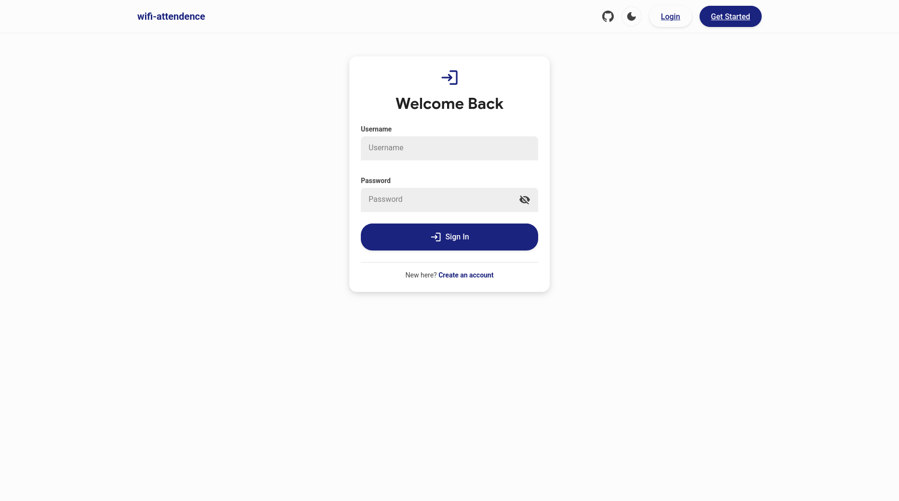</td>
    <td>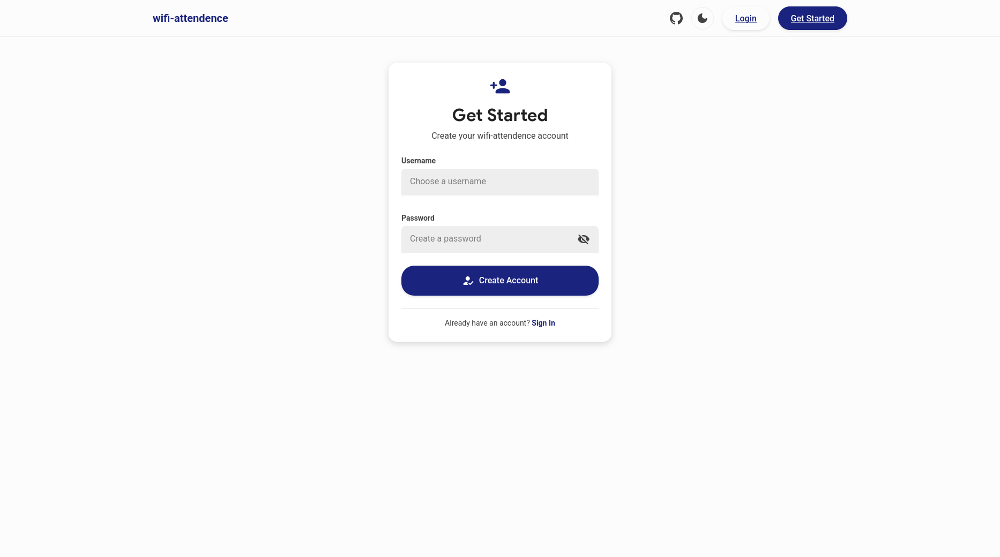</td>
  </tr>
  <tr>
    <td>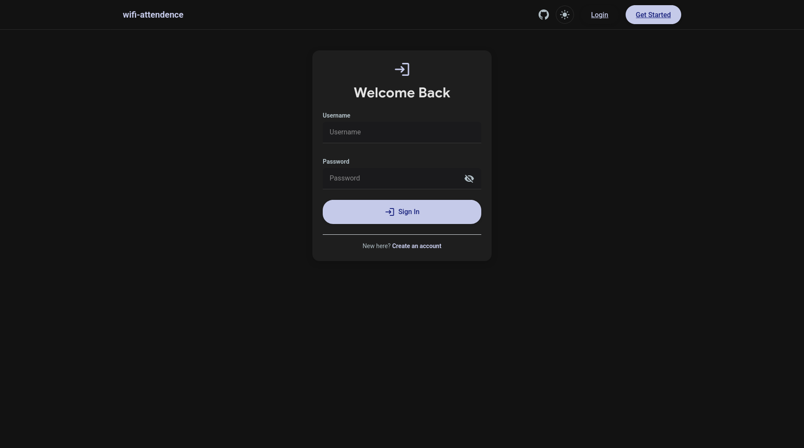</td>
    <td>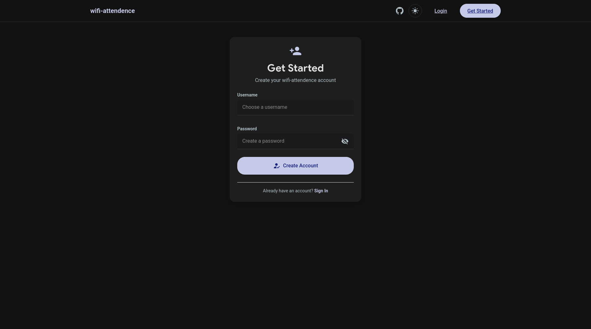</td>
  </tr>
</table>

### 📊 Dashboard

<table width="100%">
  <tr>
    <th width="50%">💼 Host Dashboard (Light / Dark)</th>
    <th width="50%">👥 Attendee Dashboard (Light / Dark)</th>
  </tr>
  <tr>
    <td>
      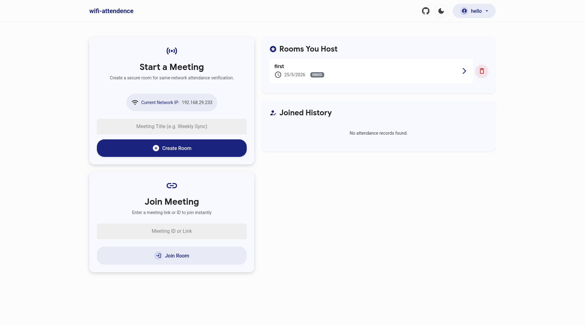
      <hr/>
      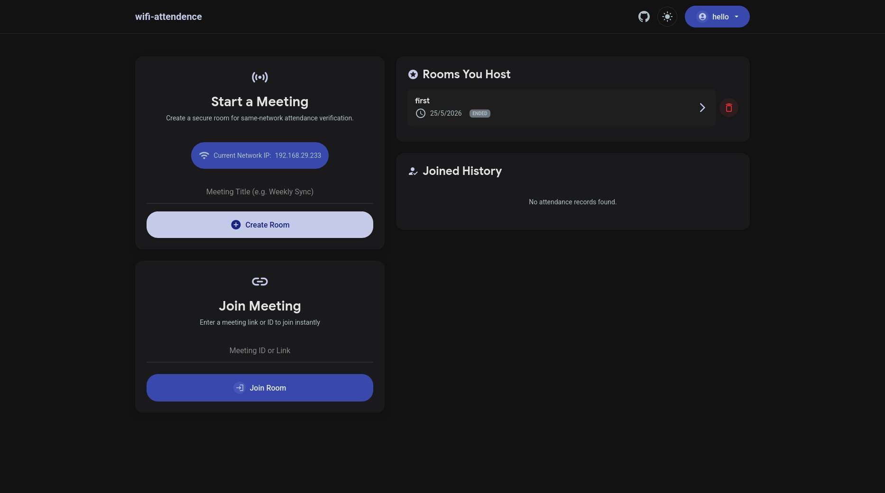
    </td>
    <td>
      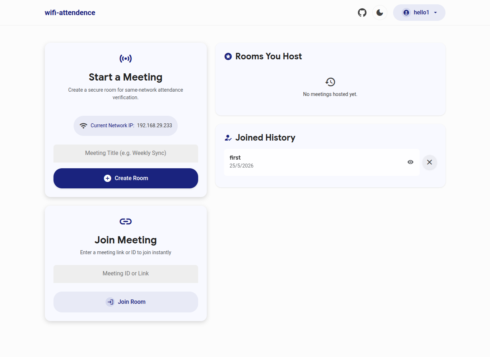
      <hr/>
      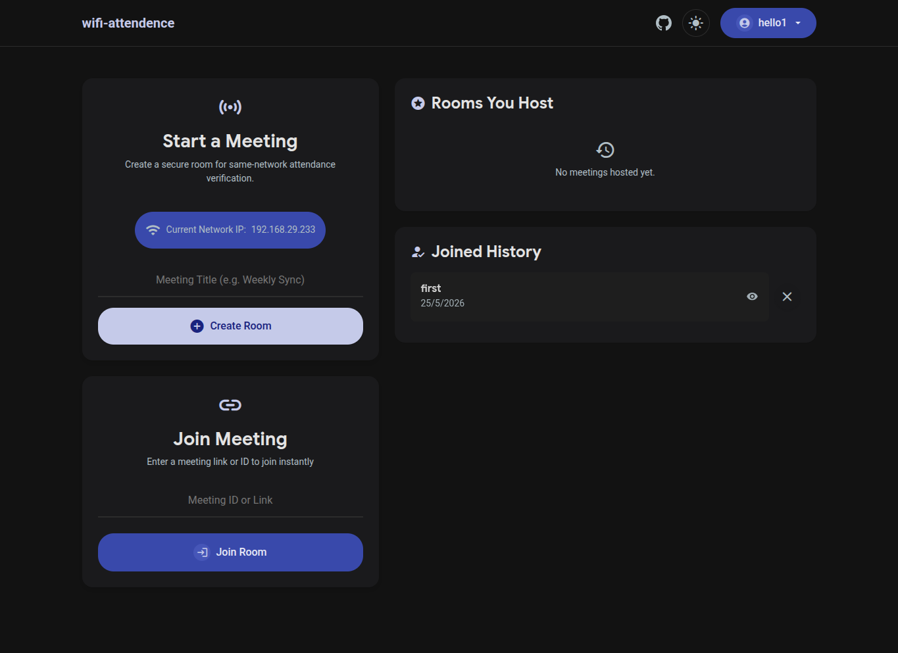
    </td>
  </tr>
</table>

### 🏠 Meeting Room & Live Polling

<table width="100%">
  <tr>
    <th width="50%">👑 Host Live Meeting (Light / Dark)</th>
    <th width="50%">🙋 Attendee Live Meeting (Light / Dark)</th>
  </tr>
  <tr>
    <td>
      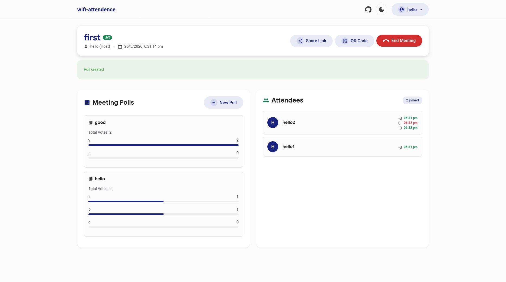
      <hr/>
      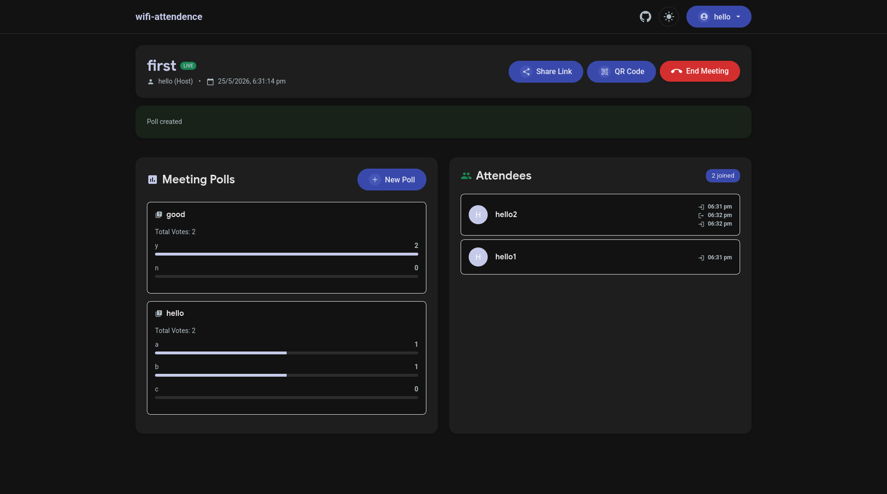
    </td>
    <td>
      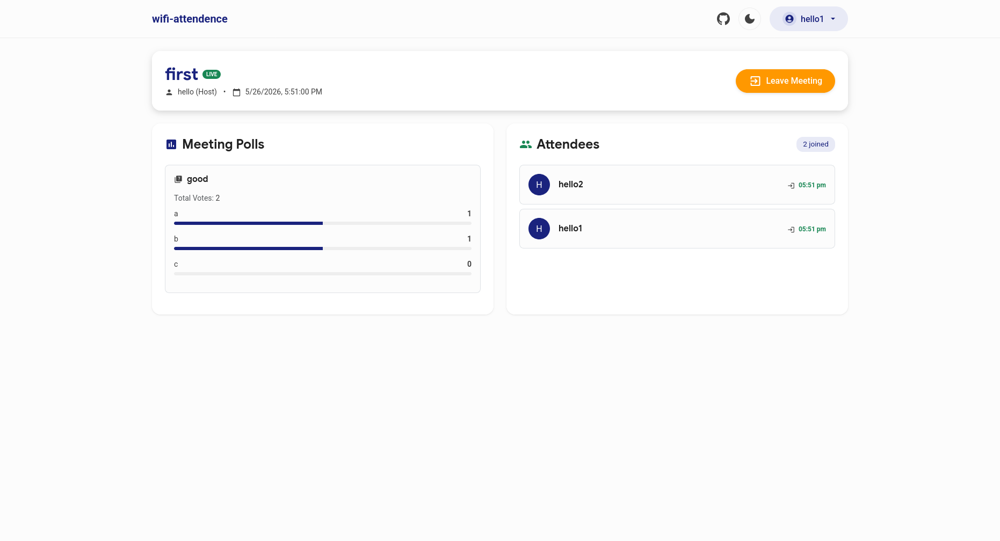
      <hr/>
      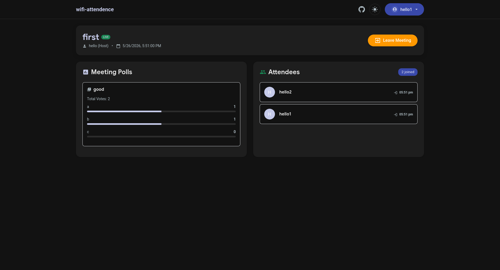
    </td>
  </tr>
</table>

### 📄 Meeting End

<table width="100%">
  <tr>
    <th width="50%">📊 Host Meeting End (Light / Dark)</th>
    <th width="50%">🛑 Attendee Meeting End (Light / Dark)</th>
  </tr>
  <tr>
    <td>
      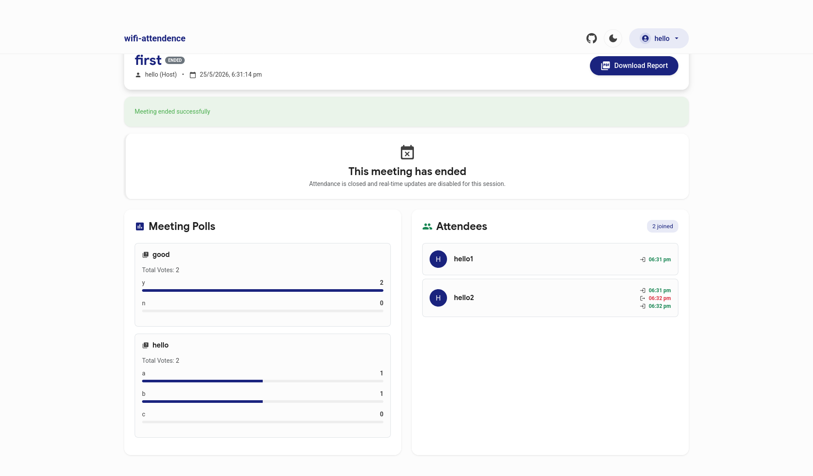
      <hr/>
      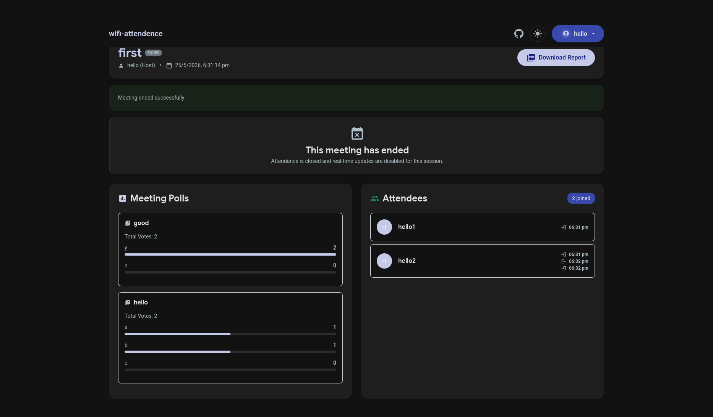
    </td>
    <td>
      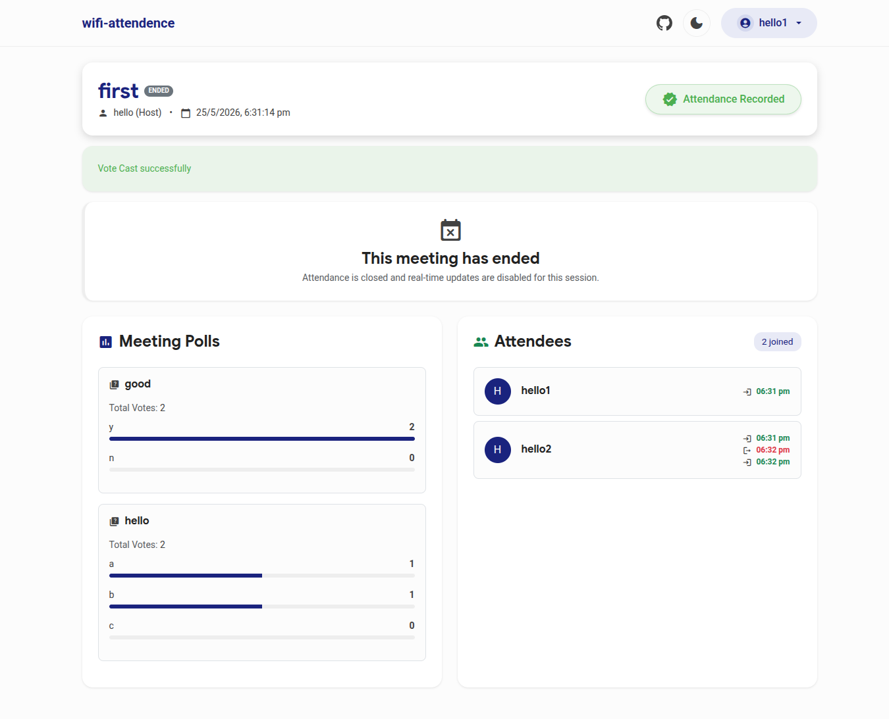
      <hr/>
      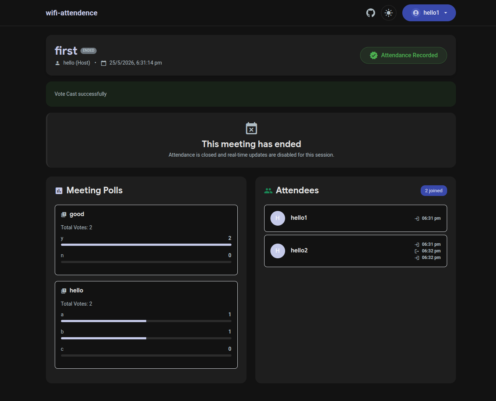
    </td>
  </tr>
</table>

### 🎥 Demo Video

[results/video.mp4](results/video.mp4)

## 🔮 Future Improvements

> Input sanitization, rate limiting, and security hardening

## ☁️ Deployment

[](https://railway.app)
[](https://wifi-attendance.up.railway.app/)

**Method A — Native Node.js:**

1. Sign in to Railway and click **New Project > Deploy from GitHub**.
2. Select your repository.
3. Railway automatically detects the Node.js project, runs `npm install`, and starts the server using your `package.json`'s start script.
4. Go to **Settings > Generate Domain** to get a public URL.

**Method B — Docker:**

1. Click **New Project** on Railway.
2. Select **Deploy from GitHub** and connect your repository.
3. Railway scans the repository, detects the `Dockerfile`, and automatically builds the image.
4. Go to **Settings** and click **Generate Domain** to access your containerized deployment.

## 👤 Author

[](mailto:akshatjasrotia85@gmail.com)
[](https://youtube.com/@akshatjasrotia)
[](https://https://github.com/akshat-jasrotia)
